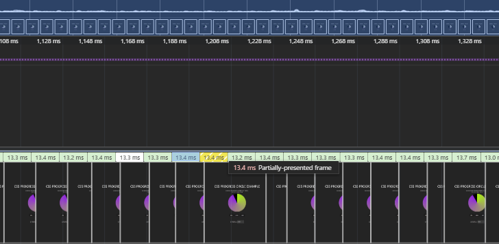

# React + CSS @property + WAAで作る！ 


インタラクティブなUI実装の手段は色々あり、特に最近はイケてるアニメーションもたくさんあるため、スクラッチで実装する機会も減ってきているのではないかと思います。


そういうわけでこの記事では、比較的新しいCSSの機能である **CSS `@property`** (CSS Houdiniの一部) と **Web Animations API (WAA)**のキャッチアップとして、簡単なプログレスUIを作成してみたいと思います。

## 今回作るもの

この記事で作成するプログレスサークルの完成形はこちらです。

https://css-progress-circle.vercel.app/

このプログレスサークルは以下の機能を持ちます:
* アニメーションの**再生**
* アニメーションの**一時停止**
* アニメーションの**リセット** (開始状態に戻す)
* アニメーションの**実行時間**をユーザーが入力し、動的に変更

## CSS `@property` とは？ (What is CSS @property?)

CSS `@property` は、**CSS Houdini** と呼ばれる、ブラウザのレンダリングエンジンに開発者がアクセスできるようにする低レベルAPI群の一部です。`@property` の最も重要な機能は、**開発者が独自のCSSカスタムプロパティに「型」を定義できる**ことです。

```css
@property --angle {
  syntax: "<angle>"; /* このプロパティが「角度」であることをブラウザに伝える */
  inherits: false;   /* 親要素から値を継承しない */
  initial-value: 360deg; /* 初期値 */
}
```

通常、CSSカスタムプロパティ（例: --my-color: red;）はブラウザには単なる文字列として扱われます。しかし、@property で syntax を指定すると、ブラウザはそのプロパティが特定の型（例: <angle>, <length>, <percentage>, <color> など）を持つことを理解します。

これにより、ブラウザはその値を適切に解釈し、**補間（アニメーション）**できるようになります。今回の例では、--angle を <angle> 型として定義したことで、0deg から 360deg のような角度の変化をスムーズにアニメーションさせることが可能になります。これは、@property なしでは直接アニメーションさせることが困難だった conic-gradient の角度指定部分などをアニメーションさせる上で非常に重要です。

## conic-gradient で円を描画 

プログレスサークルの視覚的な表現には、CSSの conic-gradient() 関数を使用します。これにより、要素の中心から放射状に色が変化するグラデーションを作成することができます。

```css
.progressCircle {
  width: 300px;
  height: 300px;
  border-radius: 50%;
  /* conic-gradient を使用 */
  background-image: conic-gradient(
    lch(86.29% 94.85 119.35) 0deg, /* 開始色 (ここでは明るい紫) */
    #9127e7 var(--angle),         /* カスタムプロパティ `--angle` の角度まで同じ色 */
    #000000 calc(var(--angle) + 1deg) /* `--angle` の直後から背景色 (黒) */
  );
}
```

ここで重要なのは、conic-gradient の色の境界を指定する部分で、先ほど @property で定義したカスタムプロパティ --angle を使用している点です。この --angle の値が 360deg から 0deg へと変化することで、円グラフが進むような視覚効果が生まれます。

## Web Animations API (WAA) とは

Web Animations API (WAA) は、JavaScriptからCSSアニメーションやトランジションをより細かく、そして柔軟に制御するためのAPIです。

CSSの animation や transition プロパティと比較して、WAAには以下のような利点があります:
- **動的な制御:** JavaScriptから再生 (play())、一時停止 (pause())、キャンセル (cancel())、特定の位置への移動 (seek(), currentTime)、再生速度の変更 (playbackRate) など、アニメーションのライフサイクルを完全に制御できます。
- **柔軟な設定:** アニメーションのキーフレームやオプション（duration, easing など）をJavaScriptで動的に生成・変更できます。
- **パフォーマンス:** ブラウザの内部アニメーションエンジンと直接連携するため、requestAnimationFrame 内で手動でスタイルを更新するよりも効率的なアニメーションが期待できます。

## React + WAA でアニメーションを制御

ここからはReactコンポーネント内でWAAを使って、`--angle` プロパティをアニメーションさせ、ユーザーインターフェースからの操作を実装する方法を見ていきましょう。


### 1. 要素の参照とアニメーションオブジェクトの保持

`useRef` を使ってアニメーション対象のDOM要素 (`.progressCircle`) と、WAAが生成する `Animation` オブジェクトへの参照を保持します。

```tsx
import { useEffect, useRef, useState } from "react";

// ...

const circleRef = useRef<HTMLDivElement | null>(null);
const animationRef = useRef<Animation | null>(null);
const [duration, setDuration] = useState<number>(10000); // アニメーション時間 (ms)
const [running, setRunning] = useState<boolean>(false); // 再生状態
```

### 2. アニメーションの作成(`useEffect`)

`useEffect` を使って、コンポーネントのマウント時や `duration` が変更されたときにアニメーションを作成（または再作成）します。

```tsx
useEffect(() => {
  if (circleRef.current) {
    const circle = circleRef.current;

    // WAA を使用してアニメーションを作成
    const animation = circle.animate(
      // キーフレーム: CSSカスタムプロパティ '--angle' を変化させる
      [
        { "--angle": "360deg" }, // 開始状態 (満タン)
        { "--angle": "0deg" }    // 終了状態 (空)
      ],
      // オプション
      {
        duration: duration,     // React State から取得した実行時間
        easing: "linear",       // 線形変化
        fill: "forwards",       // アニメーション終了後、最後の状態を維持
      }
    );

    // 作成した Animation オブジェクトを ref に保存
    animationRef.current = animation;
    // 初期状態は一時停止
    animationRef.current.pause();
  }

  // クリーンアップ関数: コンポーネントのアンマウント時や再実行前にアニメーションをキャンセル
  return () => {
    if (animationRef.current) {
      animationRef.current.cancel();
    }
  };
}, [duration]); // duration が変更されたらこの Effect を再実行
```

ここで重要なのは、`animate()` メソッドの第一引数（キーフレーム）で、CSS `@property` で定義した `--angle` をターゲットにしている点です。第二引数（オプション）では、Reactの`duration` state を使ってアニメーションの実行時間を動的に設定しています。

### 3. 再生・一時停止・リセット制御

ボタンクリックなどのイベントに応じて、`Animation` オブジェクトのメソッドを呼び出します。

```tsx
// 再生ボタンのハンドラ (例)
const handlePlay = () => {
  if (animationRef.current) {
    animationRef.current.play();
    setRunning(true); // 再生状態を更新
  }
};

// 一時停止ボタンのハンドラ (例)
const handlePause = () => {
  if (animationRef.current) {
    animationRef.current.pause();
    setRunning(false); // 再生状態を更新
  }
};

// リセットボタンのハンドラ (例)
const handleReset = () => {
  if (animationRef.current) {
    animationRef.current.cancel(); // アニメーションをキャンセルし、初期状態に戻す
    setRunning(false); // 再生状態を更新
  }
};

// running state の変更に応じて play/pause を実行
useEffect(() => {
  if (animationRef.current) {
    if (running) {
      animationRef.current.play();
    } else {
      animationRef.current.pause();
    }
  }
}, [running]);
```

### 4. 実行時間の変更

ユーザーが入力フィールドで実行時間を変更すると、`duration` state が更新されます。これにより、アニメーション作成の `useEffect` が再実行され、新しい `duration` でアニメーションが再生成されます。

```tsx
<input
  type="number"
  value={duration}
  onChange={(e) => setDuration(Number(e.target.value))}
  min={0}
  placeholder="10000(ms)"
/>
```

## 考慮事項

### ブラウザサポート

CSS Houdini (@property) は比較的新しい技術であり、すべてのブラウザで完全にサポートされているわけではありません。主要なモダンブラウザ（Chrome, Edge, Safari, Firefox）でのサポートは進んでいますが、プロジェクトのターゲットブラウザによっては注意が必要です。WAA自体のサポートは広範囲です。

### パフォーマンス

@propertyをCSSアニメに使用する場合はパフォーマンスに注意してください。

具体的な対策として**CSSアニメがどこで処理されるか**について知っておくことをお勧めします。

**コンポジットスレッドかメインスレッドか**

https://web.dev/articles/animations-overview?hl=jaより引用

>CSS ベースのアニメーションと Web Animations（API をサポートするブラウザ）は、通常、コンポーザ スレッドと呼ばれるスレッドで処理されます。これは、スタイル設定、レイアウト、ペイント、JavaScript が実行されるブラウザのメインスレッドとは異なります。つまり、ブラウザがメインスレッドで負荷の高いタスクを実行している場合でも、これらのアニメーションは中断されることなく続行できます。
この記事で説明したように、変換や不透明度に関する他の変更も、多くの場合コンポジタ スレッドで処理できます。
アニメーションによってペイントまたはレイアウト、またはその両方がトリガーされた場合、メインスレッドが処理を行う必要があります。これは CSS アニメーションと JavaScript アニメーションの両方に当てはまります。レイアウトやペイントのオーバーヘッドは、CSS や JavaScript の実行に関連する作業を圧倒的に上回るため、この質問は無意味になります。

今回のような`background-image`に対するアニメーションは、レイアウトとペイントをトリガーすることになり、結果としてメインスレッドで処理されることになります。

アニメーションによって角度 (`deg`) がフレームごとに変わると、ブラウザはフレームごとに新しい角度に基づいたグラデーション画像を生成し直す必要があります。この画像生成処理自体も、メインスレッドで行われます。

Devtoolsでperformanceをとってみると、メインスレッド上で描画の再生成が連発していることがわかります（以下画像）




CSSアニメのパフォーマンスについてより詳しく知りたい場合、以下の記事も合わせて読んでみてください。

https://web.dev/articles/animations-guide?hl=ja